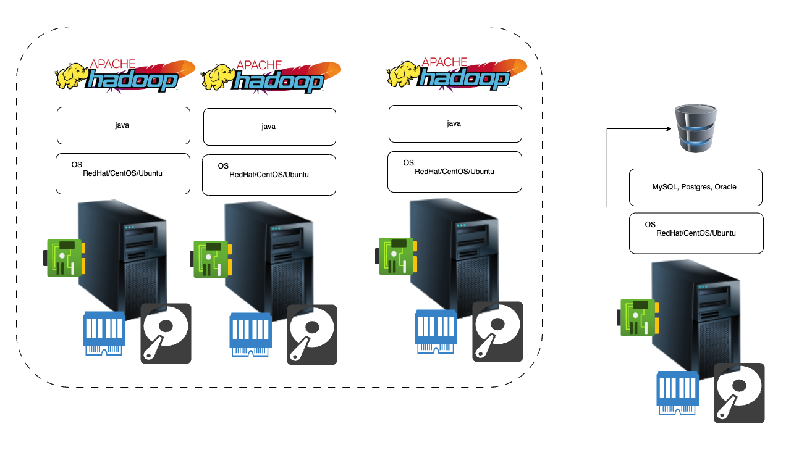

Docker
------

### Generation 1: Physical Machine 

* Running the application on Physical Server 
* Capex (upfront investment) and Opex 

### Generation 2: Hypervisors 

* Using Hypervisors we can create multiple VM's from Physical machine 

### Generation 3: Container(Docker)

* Container Engines like DOcker Can be installed on the OS and Create Containers 
* Confiner is an isolated area which contains everything necessary to run your application 

* Docker PlayGround [ReferHere](https://labs.play-with-docker.com/)